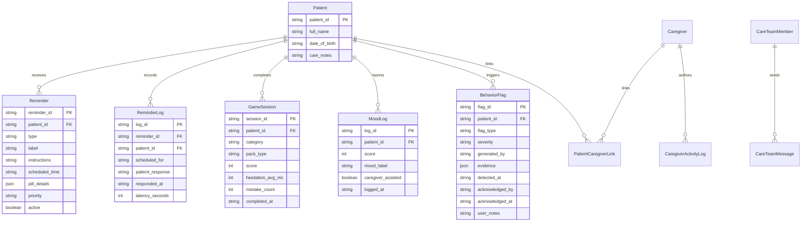
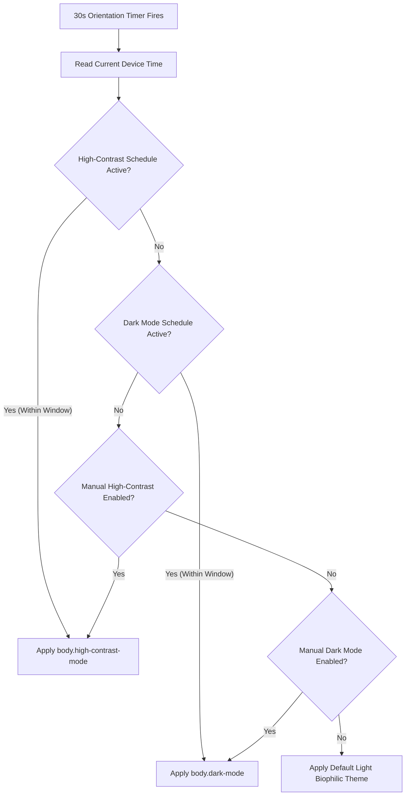

# Architecture Document — Recollect

> **Platform:** Recollect (Cognitive Care, Routine Support & Monitoring Platform)  
> **Team:** ByteForce (Smart India Hackathon 2026)  
> **Licensing:** GNU General Public License v3.0 (GPL-3.0) — Licensed to **ByteForce** and **Creatomat**  
> **Architecture Pattern:** Zero-Dependency, Local-First Progressive Web App (PWA) with Append-Only Telemetry  
> **Status:** Conforming to Running Prototype Implementation & Production Scalability Blueprint

---

## 1. Executive Architectural Summary

Recollect is built as an **offline-first, zero-dependency Progressive Web App (PWA)** designed to provide uninterrupted daily routine assistance for seniors living with early-stage cognitive impairment, real-time oversight for family caregivers, and explainable behavioral telemetry for community healthcare teams.

Unlike conventional cloud-tethered medical software, Recollect enforces a strict **local-first guarantee**: all senior interactions (medication prompts, pill confirmations, cognitive games, mood check-ins, and audio narration) execute 100% on the local client device without network dependencies.

```
+-------------------------------------------------------------------------+
|                    RECOLLECT CLIENT-SIDE ARCHITECTURE                   |
+-------------------------------------------------------------------------+
|                                                                         |
|  [ Presentation Layer: Semantic HTML5 + Vanilla CSS3 Design System ]   |
|  - Senior Patient Space (Bedside Tablet Mode)                           |
|  - Family Caregiver Portal (PIN 1234 Guarded)                           |
|  - Clinical & Community Health Hub (Passcode 9999 Guarded)              |
|                                                                         |
|  +-------------------------------------------------------------------+  |
|  |                     Application Controller                        |  |
|  |                          (js/app.js)                              |  |
|  |  - State Machine & Session Auth   - 30s Orientation & Clock Loop  |  |
|  |  - Modal & Interaction Handlers   - Theme & Contrast Scheduler    |  |
|  +-------------------------------------------------------------------+  |
|         |                     |                       |                 |
|         v                     v                       v                 |
|  +--------------+     +---------------+       +------------------+      |
|  | Rule Engine  |     | Localization  |       | Data Store Layer |      |
|  | (ruleEngine) |     | (js/i18n.js)  |       |   (js/db.js)     |      |
|  | - Phase-1    |     | - 5 Languages |       | - RecollectDB    |      |
|  |   Rules      |     | - Web Speech  |       | - localStorage   |      |
|  | - Evidence   |     | - Web Audio   |       | - Append-Only    |      |
|  |   Extraction |     |   Chimes      |       |   Clinical Logs  |      |
|  +--------------+     +---------------+       +------------------+      |
|                                                                         |
|  +-------------------------------------------------------------------+  |
|  |             Progressive Web App & Storage Boundary                |  |
|  |  - Service Worker (sw.js) Cache-First Static Asset Delivery       |  |
|  |  - Web App Manifest (manifest.json) Standalone Display Mode       |  |
|  +-------------------------------------------------------------------+  |
+-------------------------------------------------------------------------+
```

---

## 2. System Components & Runtime Architecture

### 2.1 Presentation & Accessibility Layer
* **Semantic HTML5:** Strict separation into distinct view containers (`#view-login`, `#view-patient`, `#view-caregiver`, `#view-clinical`) and modular accessible dialogs.
* **Modern CSS3 Design System (`css/styles.css`):**
  * Built on custom CSS properties (`--surface`, `--primary`, `--on-surface-variant`).
  * **Typography Baseline:** Atkinson Hyperlegible font family ensuring clear character differentiation for aging eyes.
  * **Senior Font Scaling Engine:** 3-tier CSS classes (`font-scale-normal`, `font-scale-large`, `font-scale-xlarge`) scaling base copy from 20pt to 28pt.
  * **Dark Mode Theme (`body.dark-mode`):** Deep slate palette (`#0b1329` / `#111e3e`) reducing light glare and ocular strain.
  * **High-Contrast Stark Theme (`body.high-contrast-mode`):** WCAG AAA black-and-white theme eliminating all decorative distractions.
  * **Low-Power Engine (`body.low-power-mode`):** Suppresses CSS transitions, animations, and non-critical polling to conserve battery.
  * **Print Engine (`@media print`):** Strips navigation chrome and renders a clean, professional medical document for the Doctor's Weekly Report.

### 2.2 Application Controller & State Engine (`js/app.js`)
* **Role-Based Session State:** Manages transitions across the three role spaces, verifying credentials (`1234` for Caregiver, `9999` for Clinical Hub).
* **Reactive Clock Engine:** Operates on a 30-second interval:
  1. Computes dynamic time-of-day greetings and weather conditions.
  2. Evaluates active theme schedules (Dark Mode & High Contrast Mode).
  3. Re-renders localized regional calendar strings.
* **Interactive Event Handlers:** Coordinates full-screen pill takeovers, mind game boards, audio call overlays, emergency escalations, custom task authoring, and multi-channel messaging threads.

### 2.3 Cognitive Gaming Architecture (4 Dedicated Engines & Full-Screen Canvas)
* **Full-Screen Immersion Canvas (`.game-fullscreen-takeover`):** Fixed viewport canvas (`100vw` × `100vh`, `z-index: 2100`) providing a high-focus environment with large touch targets ($\ge 64\text{px}$) and clear exit pathways (*"Pause & Rest"*).
* **Four Dedicated Modular Game Engines:**
  1. **Memory Engine (`setupMemoryGame`):** 2×4 card flip grid with active/revealed/matched states and swappable Family Photo or Northeast Cultural Heritage packs.
  2. **Attention Engine (`setupAttentionGame`):** Visual search engine generating a target spotlight flower and a 10-flower randomized garden bed. Taps on target blooms lock with glowing green borders, while non-targets trigger calming non-punitive feedback.
  3. **Language Engine (`setupLanguageGame`):** Semantic object recall engine presenting functional clues alongside 4 illustrated choices across 3 progressive rounds.
  4. **Problem Solving Engine (`setupProblemSolvingGame`):** Routine sequencing engine displaying 4 numbered sequence slots (Steps 1 to 4) and 4 shuffled routine cards. Evaluates chronological tapping order and sequentially locks steps.
* **Dual-Track Scoring & Telemetry Architecture:**
  * **Track 1: Patient-Side Uplifting Feedback:** Reassuring Garden Stars (⭐), session points (75–100 pts), and blooming stages (🌱 Sprout -> 🌻 Sunflower Champion) rendered on Eleanor's tablet without stress or countdown clocks.
  * **Track 2: Silent Clinical Telemetry:** Records decision hesitation latency (`hesitation_avg_ms`), error count, and duration in `GameSession`, immediately synchronizing with `CaregiverActivityLog`, the Doctor's Clinical Hub, and `RuleEngine`.

### 2.4 Local-First Database Layer (`js/db.js`)
* **`RecollectDB` Architecture:** Encapsulates browser `localStorage` under `STORAGE_PREFIX = 'recollect_db_'`.
* **Append-Only Immutability:** Core behavioral logs (`ReminderLog`, `GameSession`, `MoodLog`, `CaregiverActivityLog`) enforce append-only writes.
* **Seeded Baseline Data:** Automatically seeds clinical baseline reminders, care circle members, and historical messages on initial load.
* **Sync Queue (`syncQueue`):** Queues local mutations for background synchronization upon network reconnection.

### 2.5 Explainable Clinical Rule Engine (`js/ruleEngine.js`)
* **Deterministic Rules:** Evaluates patient telemetry against configurable constants (`RULE_CONFIG`):
  * **Rule A (`checkMissedRemindersStreak`):** Consecutive unacknowledged reminders ($\ge 3$ Watch, $\ge 5$ Alert).
  * **Rule B (`checkInactivityGap`):** Inactive hours without interaction ($\ge 48$h Watch, $\ge 96$h Alert).
  * **Rule C (`checkGameScoreDecline`):** 3-session score drop $\ge 25\%$ against 14-day baseline.
  * **Rule D (`checkResponseLatencyIncrease`):** Touch decision hesitation $\ge 2.0\times$ baseline.
* **Evidence Generation:** Emits `BehaviorFlag` records with mandatory, non-null quantitative evidence and plain-language summaries.
* **Composite Scoring Formula:**
  $$\text{Score} = (0.40 \times \text{Adherence \%}) + (0.40 \times \text{Game Accuracy}) + (0.20 \times \text{Engagement Frequency})$$

### 2.6 Regional Localization & Audio Synthesis (`js/i18n.js`)
* **Universal Dictionary (`RECOLLECT_I18N`):** Translates 437+ keys across 5 regional languages: English (`en`), Assamese (`as`), Bengali (`bn`), Khasi (`kha`), and Hindi (`hi`).
* **Dynamic DOM Binding:** Automatically updates elements via `data-i18n`, `data-i18n-placeholder`, `data-i18n-title`, and `data-i18n-aria`.
* **Dual-Tier Audio Synthesis:**
  * **Tier 1 (Web Speech API):** Formulates senior-friendly spoken briefings with calm parameters (`rate = 0.85`, `pitch = 1.05`) mapped to BCP-47 voices.
  * **Tier 2 (Web Audio API Pentatonic Chime Fallback):** Synthesizes a calming 5-note pentatonic progression (C4–E4–G4–A4–C5) using native `AudioContext` oscillators when speech voices are unavailable.

---

## 3. Data Model & Entity Specifications



### 3.1 Entity Schemas

#### Patient
* `patient_id` (String, PK): Unique patient identifier (`p_eleanor_vance_001`).
* `full_name` (String): Senior's legal name (`Eleanor Vance`).
* `date_of_birth` (String): ISO date (`1948-03-14`).
* `care_notes` (String): Contextual care profile information.

#### Reminder
* `reminder_id` (String, PK): Unique reminder identifier (`rem_001`).
* `patient_id` (String, FK): Linked patient identifier.
* `type` (String): Category (`medication` | `hydration` | `meal` | `appointment`).
* `label` (String): Human-readable name.
* `instructions` (String): Senior instructions displayed on card.
* `scheduled_time` (String): 24-hour time format (`09:00`).
* `pill_details` (JSON): Visual pill properties (`{ shape, count, water }`).
* `priority` (String): Alert urgency (`normal` | `critical`).
* `escalation_window_mins` (Integer): Timeout before overdue alert fires.
* `active` (Boolean): Active status flag.

#### ReminderLog (Append-Only)
* `log_id` (String, PK): Unique event identifier.
* `reminder_id` (String, FK): Associated reminder.
* `patient_id` (String, FK): Linked patient.
* `scheduled_for` (String): Intended scheduled timestamp.
* `patient_response` (String): Interaction result (`acknowledged` | `dismissed` | `no_response`).
* `responded_at` (String): Timestamp of interaction.
* `latency_seconds` (Integer): Elapsed time between chime and confirmation.

#### GameSession (Append-Only)
* `session_id` (String, PK): Unique session identifier.
* `patient_id` (String, FK): Linked patient.
* `category` (String): Activity domain (`memory` | `attention` | `language` | `problem`).
* `pack_type` (String): Card theme (`family` | `cultural`).
* `score` (Integer): Normalized performance score (0–100).
* `hesitation_avg_ms` (Integer): Mean touch decision latency in milliseconds.
* `mistake_count` (Integer): Count of unmatched card selections.
* `completed_at` (String): Completion timestamp.

#### BehaviorFlag
* `flag_id` (String, PK): Unique flag identifier.
* `patient_id` (String, FK): Linked patient.
* `flag_type` (String): Rule trigger type (`missed_reminders_streak` | `inactivity_gap` | `game_score_decline` | `response_latency_increase`).
* `severity` (String): Urgency tier (`watch` | `alert`).
* `generated_by` (String): Exact rule version (`rule_v1`).
* `evidence` (JSON, NOT NULL): Quantitative thresholds and plain-language explanation.
* `detected_at` (String): Detection timestamp.
* `acknowledged_by` (String, Nullable): Clinician ID upon review.
* `acknowledged_at` (String, Nullable): Timestamp of review.
* `user_notes` (String, Nullable): Clinical annotations.

---

## 4. Security, Access Gating & Scheduling Engine

### 4.1 Role Segregation & Authentication Architecture
* **Senior Space Gateway:** Bypasses password/PIN barriers to ensure immediate accessibility for cognitively impaired seniors.
* **Caregiver Portal Gateway:** Enforces a 4-digit PIN gate (`1234` demo PIN).
* **Clinical Hub Gateway:** Enforces a secure clinical passcode gate (`9999` demo passcode).
* **Shared Device Switching:** Authenticated caregivers can transition between Eleanor's tablet, the Caregiver Portal, and the Clinical Hub directly via the Settings modal.

### 4.2 Theme & Scheduling State Engine
Theme and contrast controls are locked behind Caregiver PIN `1234`. The scheduling engine operates deterministically:



* **Window Evaluation (`isTimeWithinWindow`):** Converts `HH:MM` start and end times to minutes from midnight, correctly handling schedules that cross midnight (e.g., 20:00 to 07:00).

---

## 5. Prototype Implementation vs. Production Roadmap

| System Area | Prototype Implementation (Active Code) | Feasible Prototype Extensions | Production Cloud Scale |
|---|---|---|---|
| **Core Architecture** | Native client-side PWA; Zero npm/build dependencies | Service Worker IndexedDB database bridge | Native mobile application (Flutter / React Native) |
| **Local Storage** | `RecollectDB` via browser `localStorage` | IndexedDB for multi-year telemetry storage | SQLite on device with cloud PostgreSQL sync |
| **Data Synchronization** | In-memory sync queue with network toggle | Background Sync API (`SyncManager`) | Bi-directional WebSocket / REST delta sync |
| **Speech Narration** | Web Speech API synthesis with BCP-47 targeting | Bundled MP3 regional voice audio assets | On-device lightweight neural TTS runtime |
| **Melodic Fallback** | Web Audio API pentatonic chime synthesis | Custom audio sprite playback | High-fidelity hardware acoustic prompts |
| **Voice Calling** | Simulated calling modal with ringing & timer | In-browser WebRTC audio peer connection | SIP / VoIP telephony gateway |
| **Emergency Alerts** | In-app notification & simulated SMS fallback | Web Push API notifications | National Emergency 112 & SMS Gateway API |
| **Clinical Reports** | Native `@media print` clean browser PDF export | Client-side jsPDF document rendering | Automated scheduled EHR PDF delivery |
| **Telemedicine (ABDM)** | Formatted ABHA referral packet generator | ABDM Sandbox API mock endpoints | Live Ayushman Bharat Digital Mission Bridge |
| **Compliance Export** | One-tap JSON bundle export adhering to DPDP/GDPR | Encrypted AES-256 zip archive download | Certified HIPAA/DPDP cloud storage vault |

---

## 6. Deployment & Hosting Specifications

* **Static Hosting:** Pre-configured with `.nojekyll` to enable seamless static deployment via GitHub Pages, Cloudflare Pages, AWS S3, or Apache/Nginx.
* **Service Worker Caching (`sw.js`):** Cache-first static asset strategy with an offline fallback ensuring complete functionality when disconnected.
* **Local Developer Server:** Operates with zero configuration via standard HTTP servers:
  ```bash
  python3 -m http.server 8000
  ```
